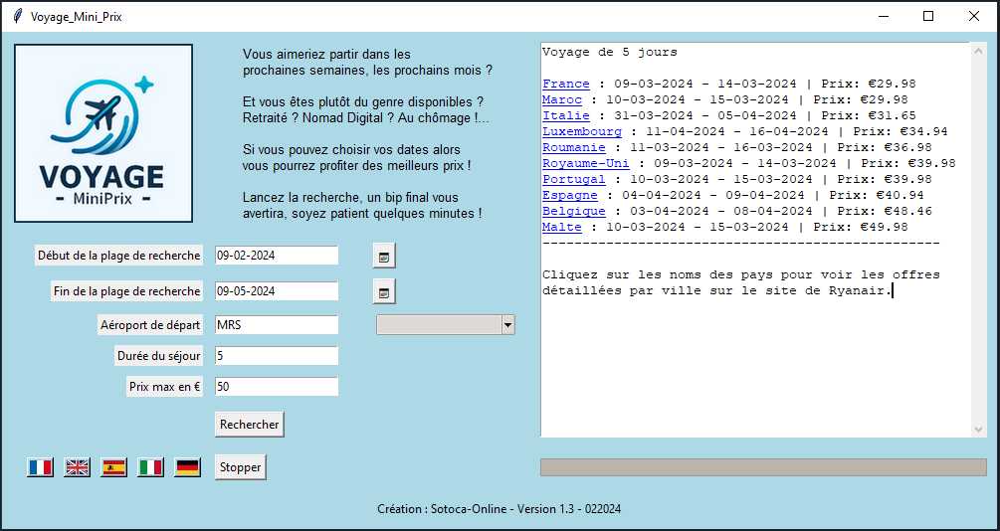

# Application "Voyage Mini Prix"

## Description
L'application VoyageMiniPrix est conçue pour aider les utilisateurs à trouver les meilleures offres de vols en fonction de leurs critères de voyage. Particulièrement adaptée aux personnes qui peuvent s'échapper facilement de leur quotidien ou qui sont Nomad Digital. Elle offre une interface graphique facile à utiliser, permettant de saisir des informations telles que la période de départ, l'aéroport de départ, la durée du séjour et le prix maximum désiré. Cette application récupére les données des vols sur le web et les afficher à l'utilisateur.

## Fonctionnalités
- Interface utilisateur graphique intuitive avec Tkinter.
- Sélection des dates via un calendrier intégré.
- Recherche des vols en utilisant Selenium pour le scraping web.
- Affichage des résultats de recherche dans une zone de texte défilante.
- Possibilité de réinitialiser le formulaire de recherche.

## Interface

Voici un aperçu de l'interface de l'application :

## Prérequis
Avant de lancer l'application, assurez-vous d'avoir installé Python et les bibliothèques suivantes :
- `selenium`
- `tkcalendar`
- `bs4` (BeautifulSoup)
- `webdriver_manager`

Vous pouvez installer ces bibliothèques en utilisant la commande `pip install` :
- pip install beautifulsoup4==4.12.2 selenium==4.14.0 tkcalendar==1.6.1 webdriver-manager==4.0.1

## Comment utiliser
1. Clonez ce dépôt sur votre machine locale.
2. Assurez-vous que tous les prérequis sont installés.
3. Exécutez le script Python à l'aide de la commande `python chemin_du_script.py`.
4. Une fois l'application lancée, entrez vos critères de recherche et cliquez sur le bouton "Rechercher".

## Respect des règles de scraping
Cette application respecte les directives de scraping du site web consulté. Pour les recherches impliquant Ryanair, il n'y a pas, au jour de la création du logiciel (02/2024) de directive dans le robots.txt qui mentionne spécifiquement les URL contenant /cheap-flights-beta. Merci de prendre contact avec l'auteur si celà devait changer.

## Contribution
Les contributions à ce projet sont les bienvenues. Si vous souhaitez contribuer, veuillez forker le dépôt, créer une branche pour vos modifications, et soumettre une pull request.

## Licence
Ce projet est distribué sous licence MIT. Voir le fichier `LICENSE` pour plus d'informations.

## Contact
Pour toute question ou suggestion, veuillez contacter le créateur de l'application à l'adresse suivante : [eric.sotoca@gmail.com]

